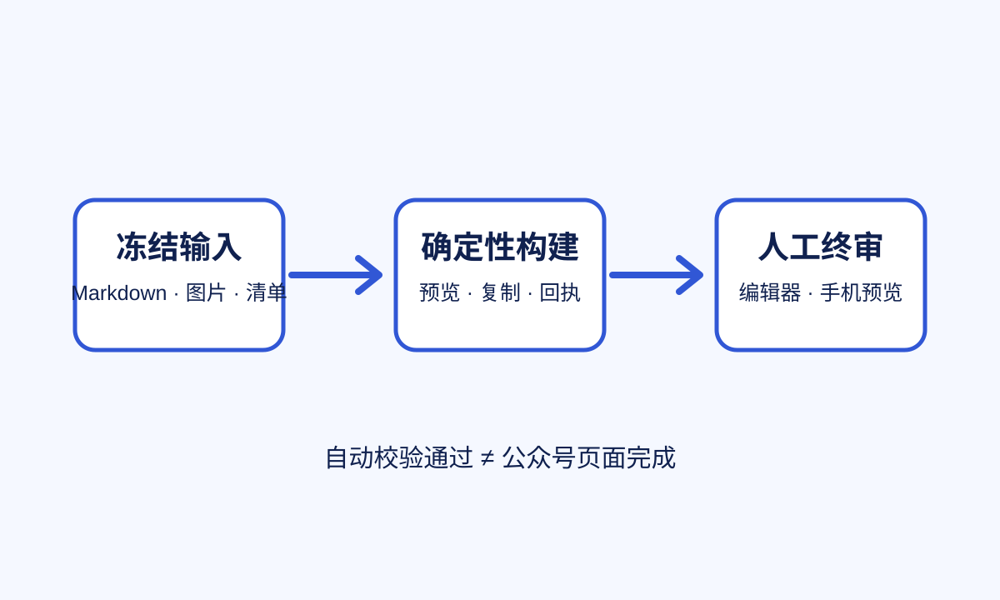

# 仿真项目复盘：把交付标准放到用户看见的地方

一份内容进入排版阶段以后，真正需要控制的不是“生成了多少文件”，而是正文、图片和版本是否仍然一一对应。

> 本例中的机构、人物、流程和数据均为仿真，不对应真实项目。

## 一、先冻结输入

构建前保留三个确定输入：

- 已确认的 Markdown；
- 已确认的正式图片；
- 记录文章 ID、图片清单和验收状态的交接清单。

## 二、自动检查与人工判断分层

自动化适合核对哈希、图片引用和文件结构。公众号编辑器里的实际粘贴效果、保存重开结果和手机阅读节奏，仍然需要人工判断。

这不是降低标准，而是把**确定性检查**和`mobile acceptance`放到各自适合的位置。

## 三、交付结论

本地构建完成只意味着复制材料已经就绪。只有手机预览通过，才可以把本次页面记为人工验收通过。
